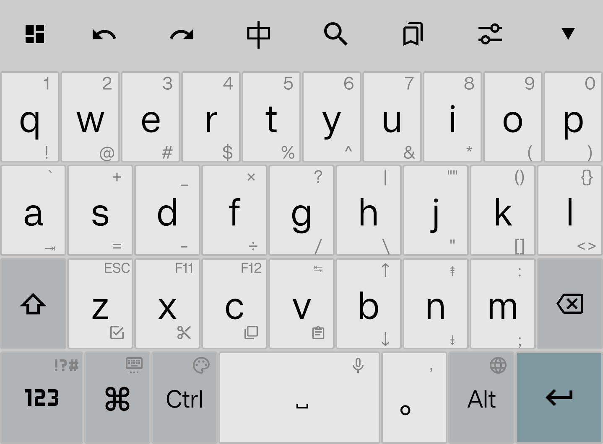
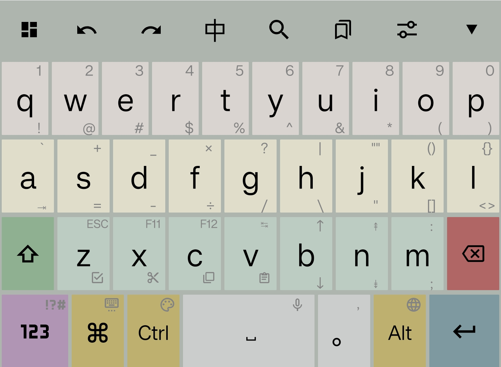
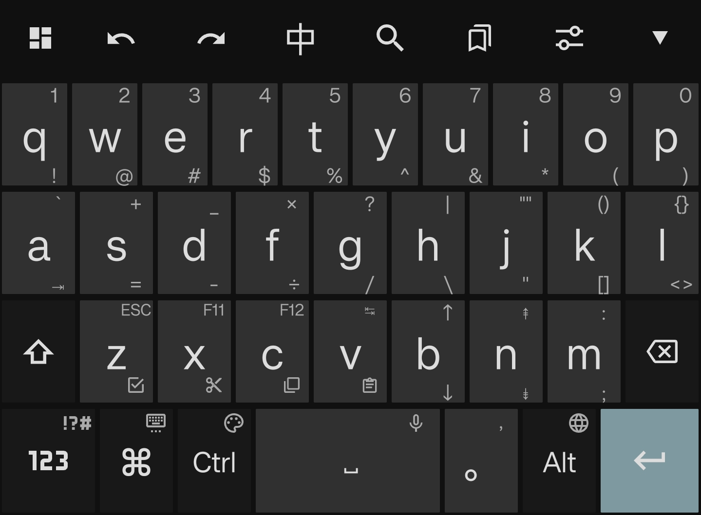
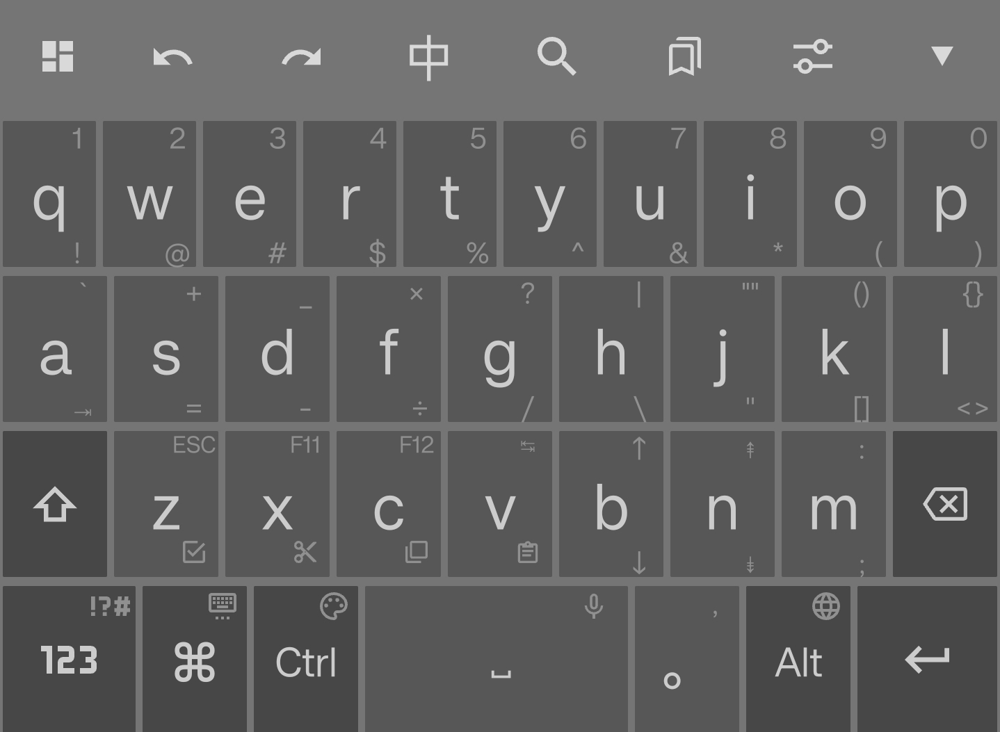
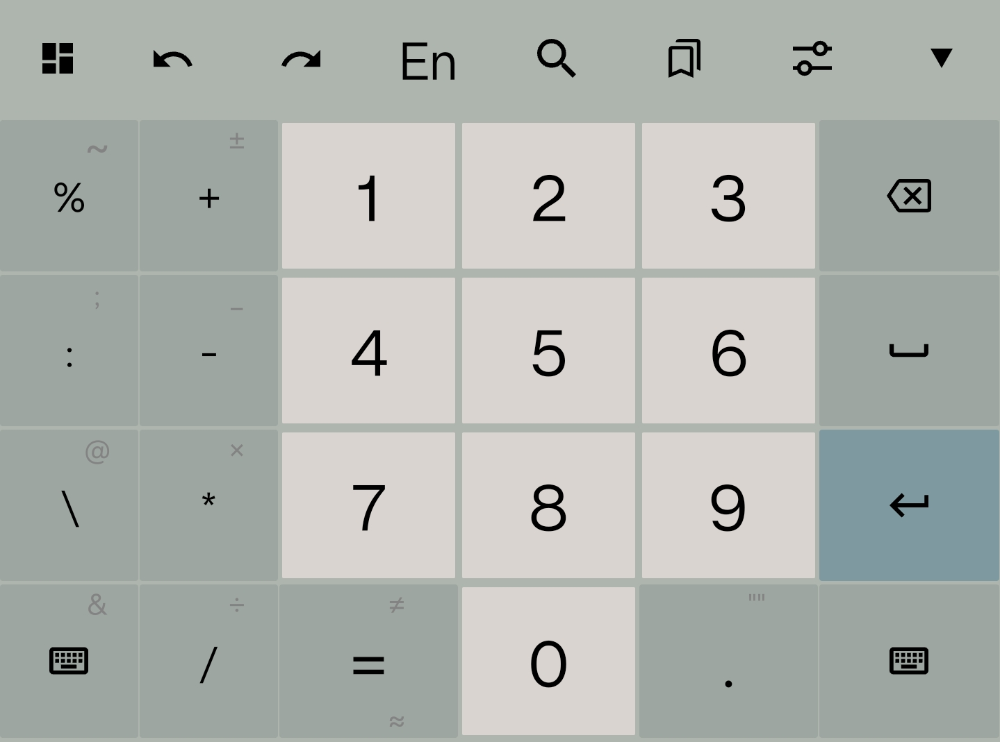
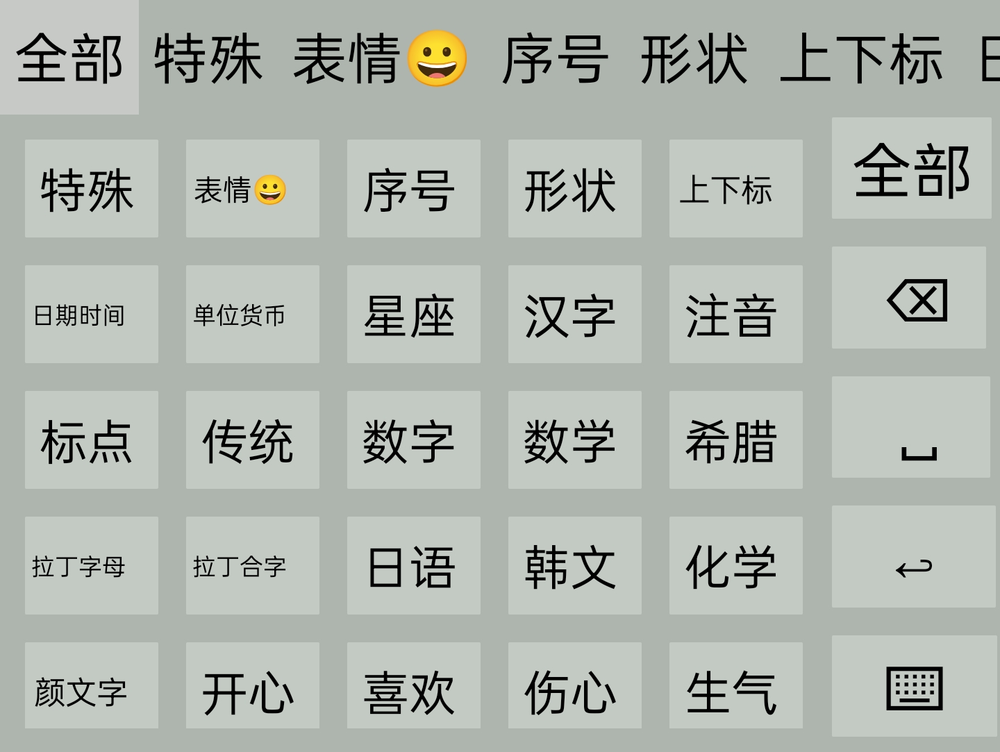

## Trime 极客键盘

本键盘主题在以下组合下使用最佳:

* 运行平台：安卓
* App：[同文输入法](https://github.com/osfans/trime) (Trime)
* [万象拼音](https://github.com/amzxyz/rime_wanxiang)方案 (可加载大模型)
* 两个深色主题, 两个浅色主题


| 破晓 | 繁花 | 深夜 | 渐晚 |
| :---: | :---: | :---: | :---: |
|  |  |  |  |


### 功能如下
* 符号尽可能与电脑键盘一致。支持上滑、下滑、长按三种输入模式。
* `V键`：文本选择模式（上滑选整行、左滑选光标左侧、右滑选光标右侧）
* `B键`上下左右滑动：↑↓←→光标移动
* `N键`上下左右滑动：`PageUp`、`PageDown`、`Home键` 和 `End键` 
* 长按数字键 `1` ~ `0`: 分别对应 `F1` ~ `F10`
* `A键`下滑：Tab键
* ZXCV下滑：分别是全选 剪切 复制 粘贴
* ZXCV上滑或长按：`Esc`、`F11`、`F12`键
* `删除键`⌫：
    * 上滑: 删除整行
    * 下滑: Delete（向后删除）
    * 左滑: 删词（相当于 Control-Backspace ）
* `空格键`：
    * 上滑、下滑: 切换中英文模式
    * 长按: 语音输入（需要第三方软件支持）
    * 按住并左右滑动: 快速移动光标
* `句号（。）键`：长按-切换中英文标点符号
* 支持Win、Ctrl、Alt键
    * `Win键`长按: 修改键盘主题
    * `Ctrl键`长按: 修改键盘配色
    * `Alt键`长按: 切换方案、切换输入法

### 中文输入模式下
* `Alt`变成`Esc`可以一键取消输入
* 长按`A键`（输入`）进入**笔画模式**（hspnz分别代表横竖撇捺折），也可以输入偏旁部首的首拼字母筛字。生僻字输入神器。

### 数字键盘

* 上滑数字输入上标（¹²³⁴⁵⁶⁷⁸⁹⁰）
* 下滑数字输入下标（₁₂₃₄₅₆₇₈₉₀）

<p align="center">
  
</p>


### 符号键盘

* 根据 [万象符号](https://github.com/amzxyz/rime_wanxiang/blob/wanxiang/wanxiang_symbols.yaml) 分类
* 增加并修复颜文字

<p align="center">
  
</p>

### 键盘下边距调整

我的手机键盘下方是有留白的，下边距设置为35。如果你的键盘下边距过大，可以按照下面的方法进行调整：

```yaml
patch:
  style/keyboard_padding_bottom: 0
```

项目中已经包含了补丁文件 [geek.trime.custom.yaml](./geek.trime.custom.yaml) ，可以直接使用。

### 其他

* 符号搜索: [https://pictogrammers.com/library/mdi/](https://pictogrammers.com/library/mdi/)
